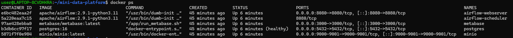
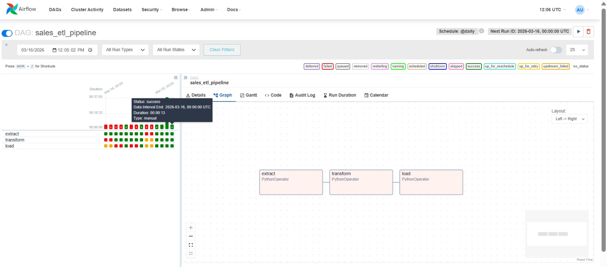
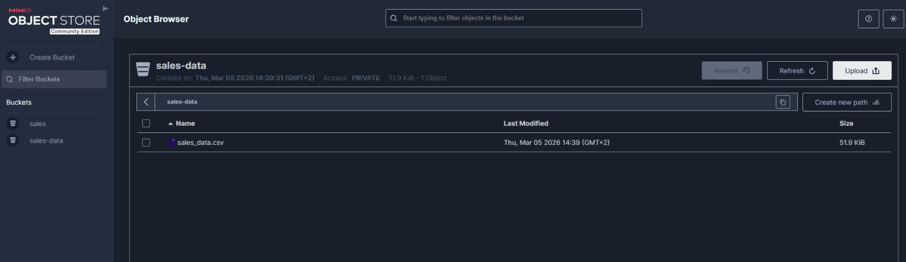
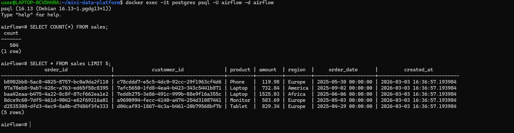
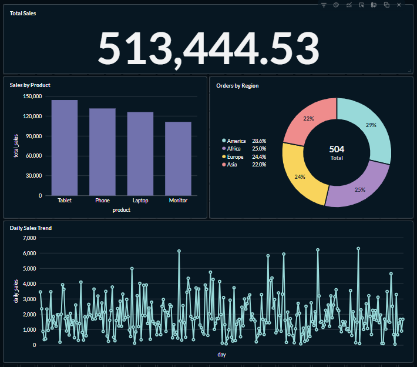

#  Mini Data Platform

##  Overview

This project implements a **Mini End-to-End Data Platform** using modern data engineering tools.

It demonstrates how data flows from **raw ingestion → processing → storage → visualization**.

The platform processes **sales data from CSV files**, transforms it using ETL pipelines, stores it in a data warehouse, and visualizes insights through dashboards.

---

##  Tech Stack

*  **MinIO** → Object storage (S3-like)
*  **Apache Airflow** → Workflow orchestration (ETL)
*  **PostgreSQL** → Data warehouse
*  **Metabase** → Data visualization
*  **Docker** → Containerization
* **Python (Pandas, SQLAlchemy)** → Data processing

---

#  Architecture

```
        +----------------------------+
        |  Data Generator            |
        | (generate_sample_data.py)  | 
        +-----------+----------------+
                    |
                    v
              +-----------+
              |   MinIO   |
              | CSV Store |
              +-----+-----+
                    |
                    v
              +-----------+
              |  Airflow  |
              | ETL DAG   |
              +-----+-----+
                    |
                    v
             +-------------+
             | PostgreSQL  |
             | Data Store  |
             +------+------+
                    |
                    v
              +-----------+
              | Metabase  |
              | Dashboard |
              +-----------+
```

---

#  Screenshots

##  Docker Containers Running



---

##  Airflow ETL Pipeline

DAG showing:

```
extract → transform → load
```



---

##  MinIO Object Storage

CSV file stored in bucket:



---

##  PostgreSQL Data Verification

Data successfully loaded into warehouse:



---

##  Metabase Dashboard

Final analytics dashboard:

* Total Sales
* Sales by Product
* Sales by Region
* Daily Sales Trend



---

#  Project Components

## 1️. MinIO (Object Storage)

Stores raw CSV data similar to AWS S3.

* URL: [http://localhost:9001](http://localhost:9001)
* Bucket: `sales-data`
* File: `sales_data.csv`

---

## 2️. Apache Airflow (ETL Orchestration)

Manages the pipeline:

```
extract → transform → load
```

* URL: [http://localhost:8080](http://localhost:8080)

### Tasks:

* **Extract** → Download from MinIO
* **Transform** → Clean & validate data
* **Load** → Insert into PostgreSQL

---

## 3️. PostgreSQL (Data Warehouse)

Stores structured data.

**Table: `sales`**

| Column      | Description    |
| ----------- | -------------- |
| order_id    | Unique ID      |
| customer_id | Customer       |
| product     | Product name   |
| amount      | Sales value    |
| region      | Location       |
| order_date  | Date           |
| created_at  | Load timestamp |

---

## 4. Metabase (BI Dashboard)

Visualizes data with interactive dashboards.

* URL: [http://localhost:3000](http://localhost:3000)

---

#  Project Structure

```
mini-data-platform/
│
├── dags/
│   └── sales_pipeline.py
│
├── src/
│   ├── extract.py
│   ├── transform.py
│   ├── load.py
│   ├── validation.py
│   └── minio_client.py
│
├── scripts/
│   └── generate_sample_data.py
│
├── data/
│   └── sales_data.csv
│
├── sql/
│   ├── init_schema.sql
│   └── queries.sql
│
├── tests/
│   └── test_transform.py
│
├── screenshots/
│   ├── docker_containers.png
│   ├── airflow_pipeline.jpeg
│   ├── minio_bucket.jpeg
│   ├── postgres_data.png
│   └── metabase_dashboard.png
│
├── .github/workflows/
│   └── pipeline.yml
│
├── docker-compose.yml
├── requirements.txt
├── Makefile
└── README.md
```

---

#  Setup Instructions

## 1. Clone Repo

```bash
git clone https://github.com/Damas200/mini-data-platform.git
cd mini-data-platform
```

---

## 2. Start Platform

```bash
docker compose up -d
```

---

## 3. Access Services

| Service    | URL                                            |
| ---------- | ---------------------------------------------- |
| Airflow    | [http://localhost:8080](http://localhost:8080) |
| MinIO      | [http://localhost:9001](http://localhost:9001) |
| Metabase   | [http://localhost:3000](http://localhost:3000) |
| PostgreSQL | localhost:5432                                 |

---

#  Run Pipeline

1. Upload CSV → MinIO
2. Open Airflow
3. Trigger DAG:

```
sales_etl_pipeline
```

---

#  Testing

Run:

```bash
pytest
```

---

#  CI/CD Pipeline

Automated with GitHub Actions:

* Install dependencies
* Run tests
* Validate pipeline

File:

```
.github/workflows/pipeline.yml
```

---

# Key Features

* ✅ End-to-End Data Pipeline
* ✅ Object Storage Integration
* ✅ Automated ETL with Airflow
* ✅ Data Warehouse Design
* ✅ Dashboard Visualization
* ✅ Dockerized Infrastructure
* ✅ Unit Testing
* ✅ CI/CD Pipeline

---

#  Author

**Damas Niyonkuru**
Data Engineer

---

#  What I Learned

* Building scalable data pipelines
* Orchestrating workflows with Airflow
* Working with object storage (MinIO)
* Designing data warehouses
* Creating dashboards with Metabase

---

#  Conclusion

This project demonstrates a **real-world data engineering workflow** from ingestion to visualization using modern open-source tools.

It reflects best practices used in production systems and showcases skills required for a **Data Engineer role**.

